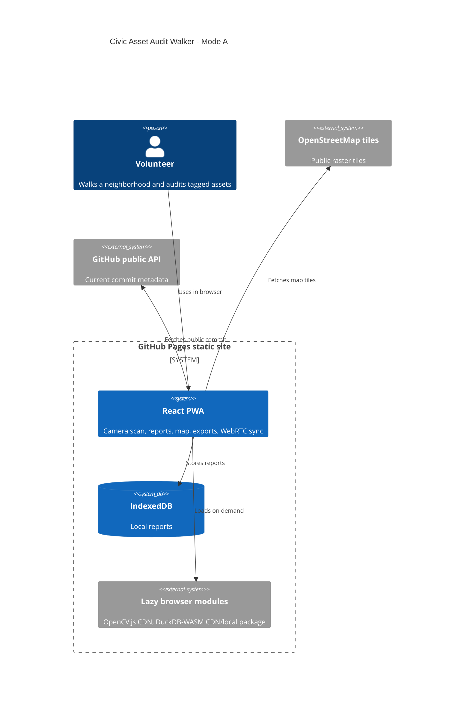

# Civic Asset Audit Walker

[](https://baditaflorin.github.io/civic-asset-audit-walker/)
[](https://baditaflorin.github.io/civic-asset-audit-walker/)
[](LICENSE)

Live site: https://baditaflorin.github.io/civic-asset-audit-walker/

Repository: https://github.com/baditaflorin/civic-asset-audit-walker

Support: https://www.paypal.com/paypalme/florinbadita

Civic Asset Audit Walker is an offline-first GitHub Pages PWA for volunteers who place cheap AprilTag stickers on streetlights, benches, bins, signs, and other neighborhood assets, then scan and report conditions without waiting for a city audit program.


## Quickstart

```bash
npm install
make install-hooks
make dev
make test
make smoke
```

## What Works in v0.1.0

- Guided AprilTag 36h11 sticker generation and centered camera scan flow.
- Offline report creation with IndexedDB persistence.
- Leaflet/OpenStreetMap report map with repository and PayPal links visible from the map.
- JSON and CSV export/import for volunteer-controlled backups.
- Manual WebRTC offer/answer sync for anonymous peer report exchange.
- DuckDB-WASM aggregate query behind a user action, with TypeScript fallback.
- PWA shell, service worker, and GitHub Pages build output in `docs/`.

## Architecture



Detailed architecture: docs/architecture.md

ADRs: docs/adr/

Deploy guide: docs/deploy.md

Privacy: docs/privacy.md

## Commands

```bash
make help
make dev
make build
make pages-preview
make test
make smoke
make lint
make fmt
make release VERSION=v0.1.0
```

## Deployment

The project is Mode A: static GitHub Pages only. `make build` writes the Pages-ready app into `docs/`, preserving documentation under `docs/adr/`. GitHub Pages serves `main` branch `/docs`.

Public URL: https://baditaflorin.github.io/civic-asset-audit-walker/

## Security

No runtime secrets are required. Real `.env*` files are ignored. Local hooks run `gitleaks protect --staged`.
