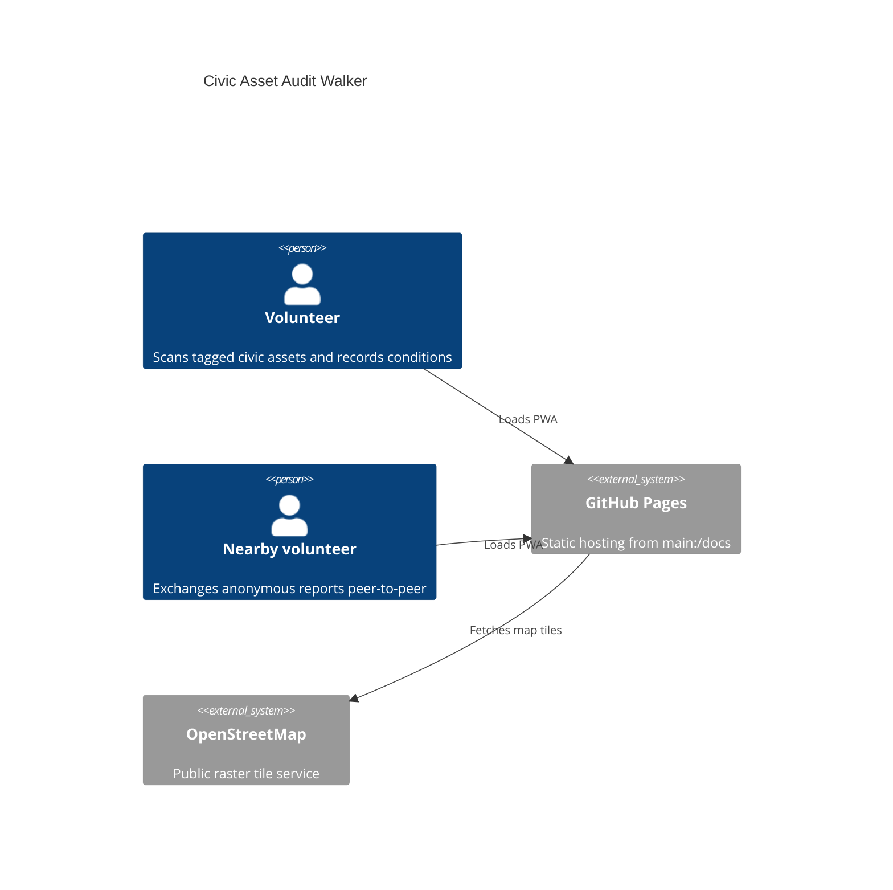
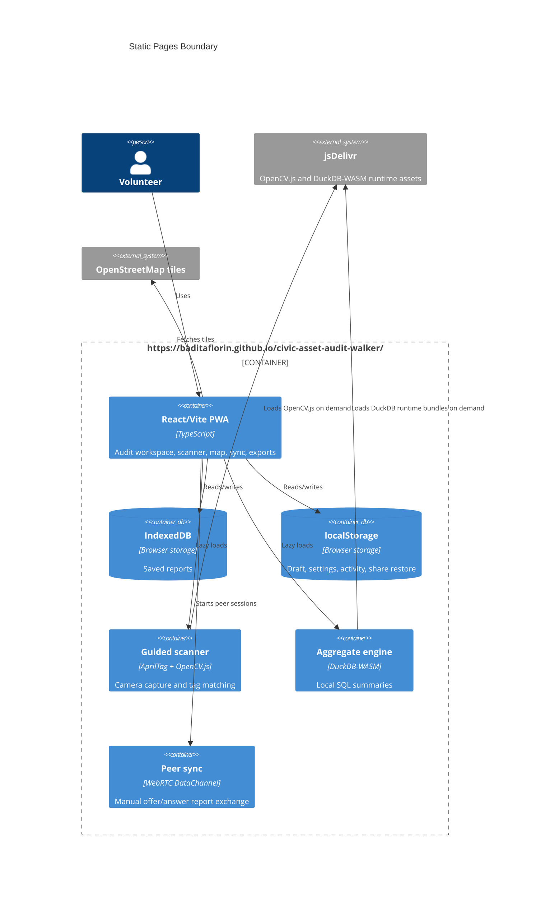

# Architecture

## Context

## Container

## Module Boundaries

- `src/features/scanner`: AprilTag rendering, centered tag matching, and OpenCV.js loader.
- `src/features/reports`: validation, report form, imports, exports, and local list.
- `src/features/workspace`: settings/history surface for backup, sharing, and reset flows.
- `src/features/map`: Leaflet/OpenStreetMap report map.
- `src/features/sync`: WebRTC manual signaling and report exchange.
- `src/features/analytics`: local aggregate fallback and DuckDB-WASM SQL aggregate.
- `src/lib`: schemas, workspace persistence, share/snapshot helpers, merge logic, hooks, and build metadata.

## Pages Boundary

The deployed artifact is committed under `docs/`. GitHub Pages serves only static files; there is no runtime server, API, secret store, Docker container, or GitHub Actions workflow.
